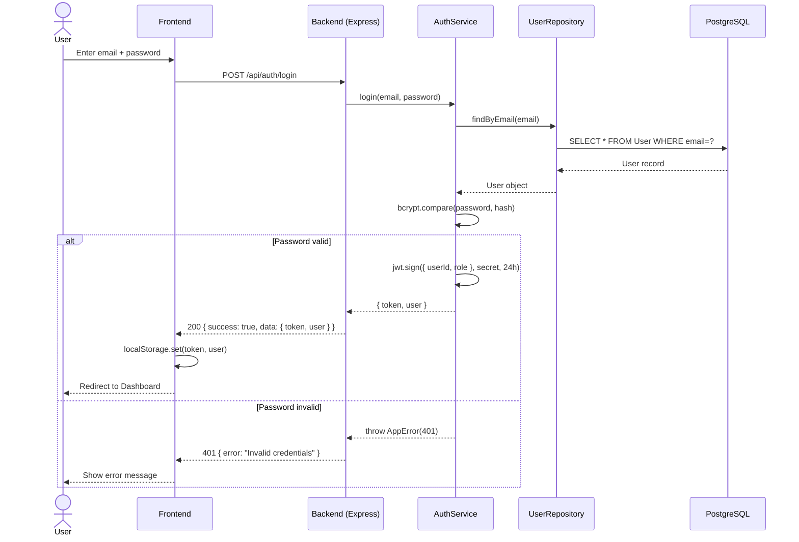
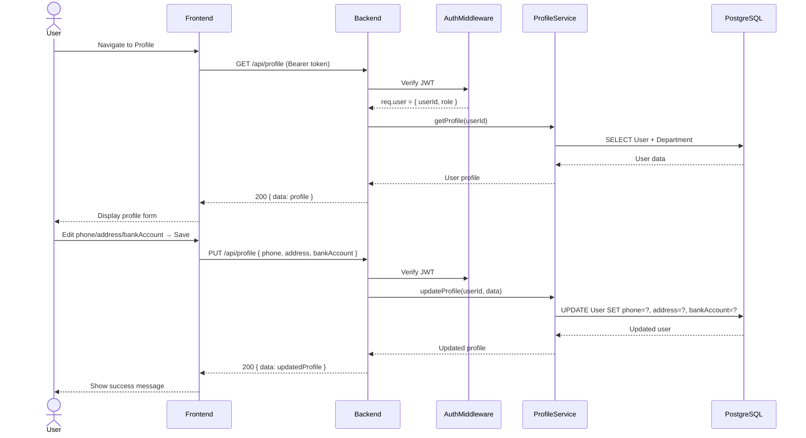
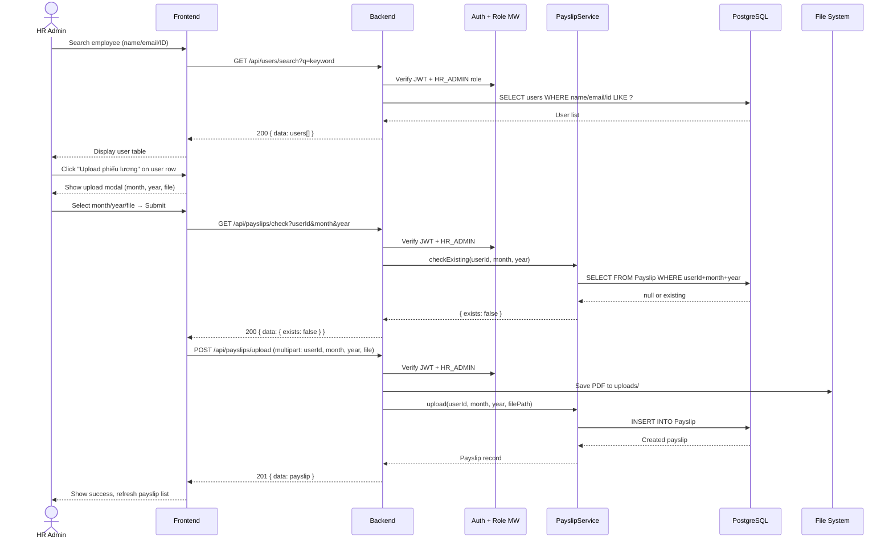
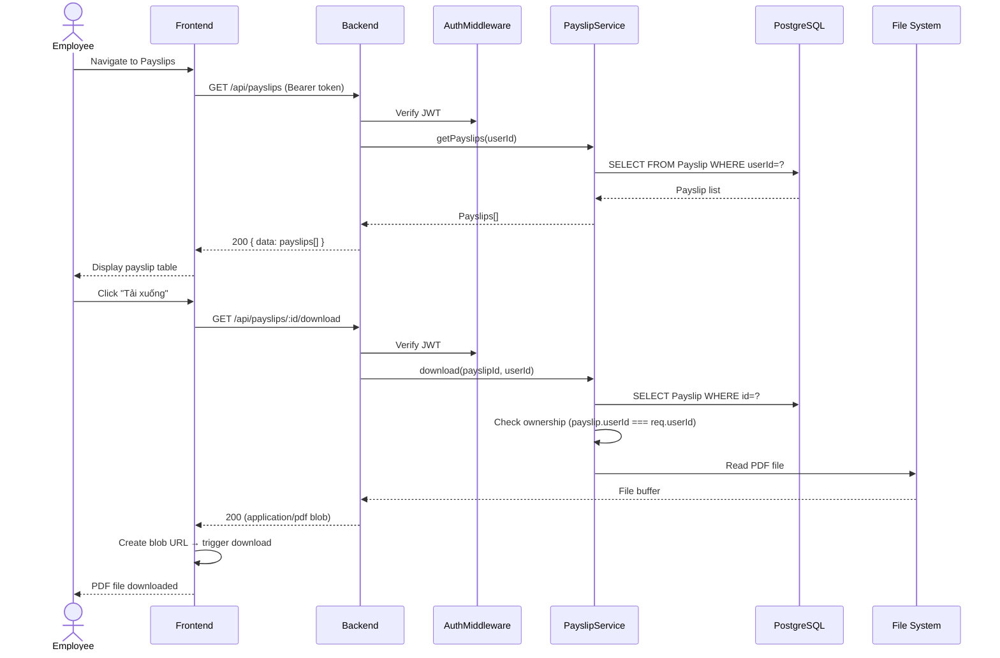
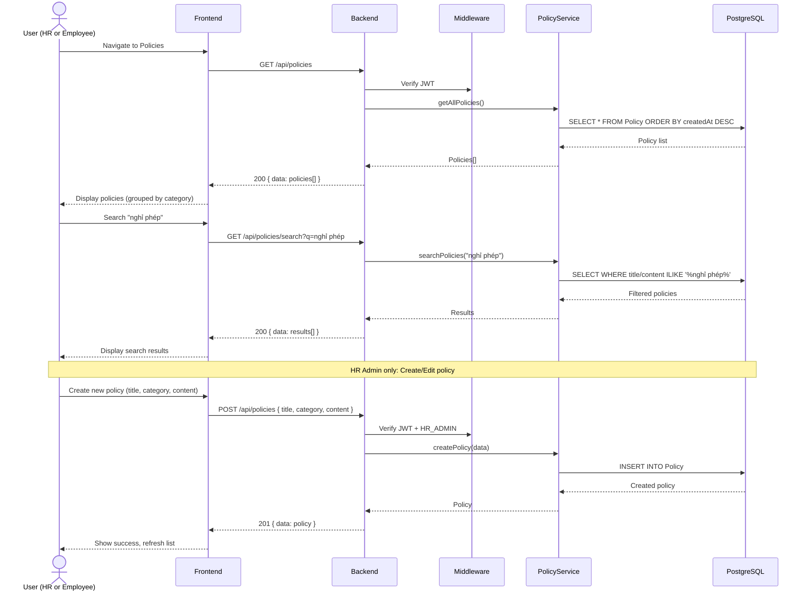
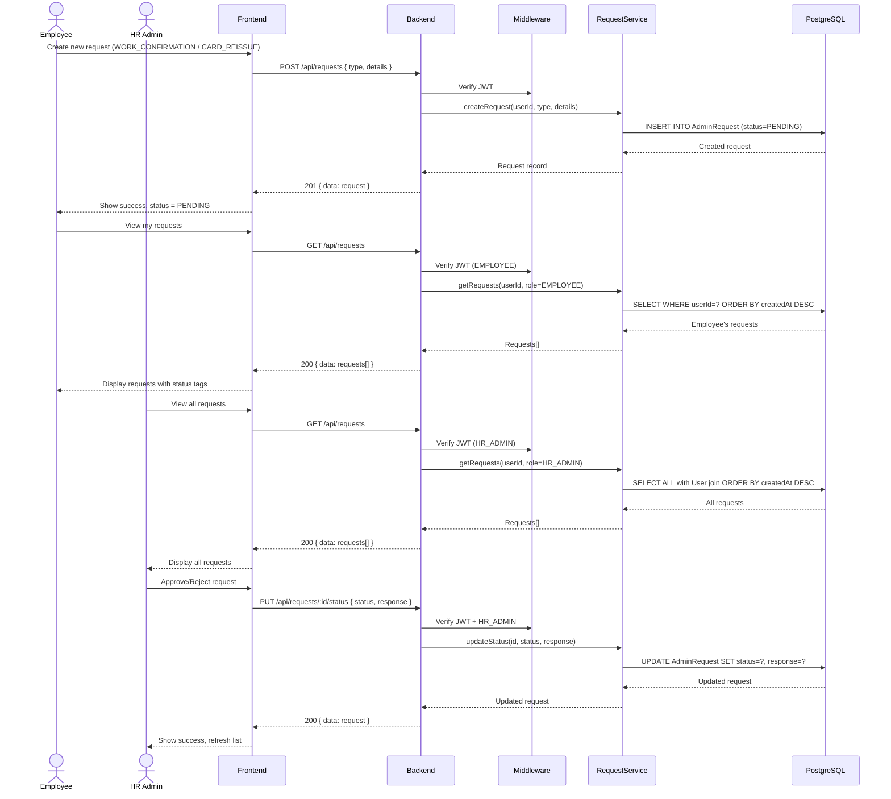
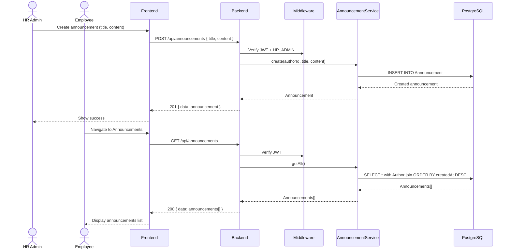
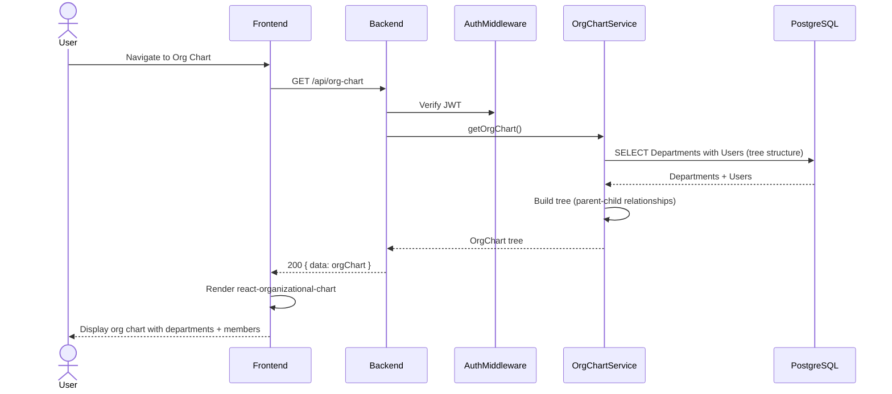
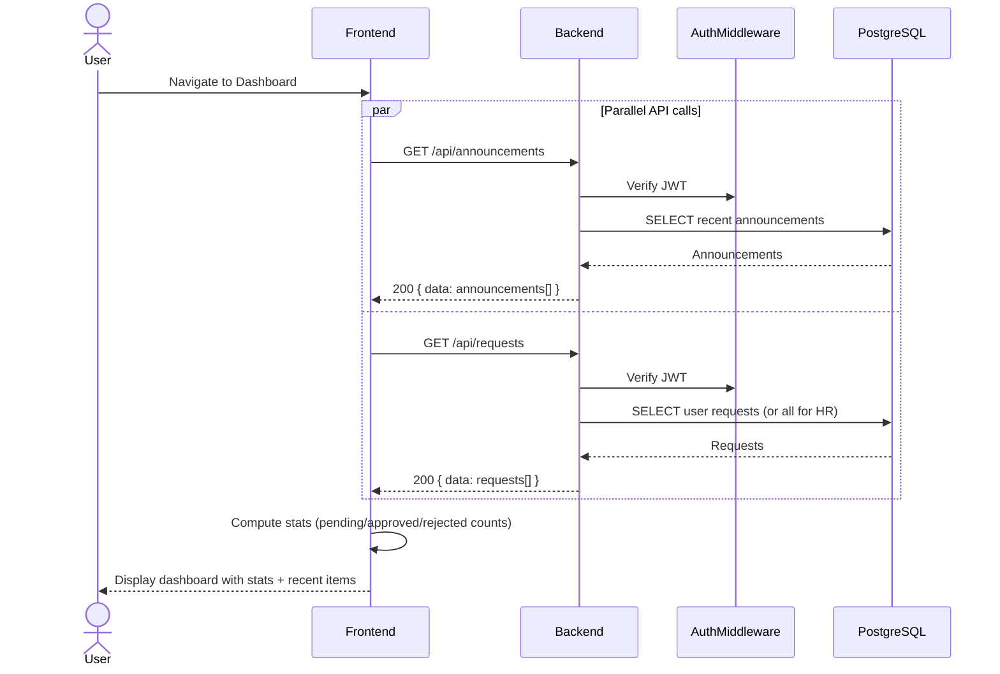

# CLAUDE.md - Employee Self-Service Portal

## Project Overview

Cổng tự phục vụ cho nhân viên (ESS Portal). Nhân viên tra cứu phiếu lương, chính sách, yêu cầu hành chính mà không cần liên hệ HR. Hệ thống phục vụ ~2000 users.

## Tech Stack

- **Backend**: Express 5 + TypeScript 6 + Prisma 5 + PostgreSQL 15
- **Frontend**: React 18 + Vite + Ant Design + TypeScript
- **Auth**: JWT (jsonwebtoken + bcryptjs), RBAC (HR_ADMIN / EMPLOYEE)
- **Docker**: node:20-alpine multi-stage, nginx:alpine frontend
- **CI/CD**: GitHub Actions → GHCR

## Architecture

```
Controllers (API) → Services (Business Logic) → Repositories (Data Access) → Prisma (DB)
```

## Commands

```bash
# Backend
cd backend && npm ci --legacy-peer-deps
npm run dev          # Development server
npm run build        # TypeScript compile
npm test             # Jest (51 tests)
npm run test:coverage

# Frontend
cd frontend && npm ci
npm run dev          # Vite dev server
npm run build        # tsc -b && vite build

# Docker
docker compose up -d --build
docker compose down

# Prisma
cd backend
npx prisma generate
npx prisma migrate dev --name <name>
npx prisma db seed
```

## Project Structure

```
backend/src/
├── config/          # database.ts, constants.ts, logger.ts
├── controllers/     # Thin API layer, delegates to services
├── services/        # Business logic, validation
├── repositories/    # Prisma data access
├── middleware/      # authMiddleware, roleMiddleware, errorHandler
├── routes/index.ts  # All route definitions + multer config
└── types/index.ts   # TypeScript interfaces

frontend/src/
├── pages/           # 8 page components
├── components/      # Layout (AppLayout, Sidebar, Header), ProtectedRoute
├── context/         # AuthContext (JWT + localStorage)
├── services/api.ts  # Axios client with JWT interceptor
└── types/index.ts   # Shared TypeScript interfaces
```

## Key Conventions

- **Language**: UI is Vietnamese, code is English
- **Imports**: Frontend uses `import type` for type-only imports (verbatimModuleSyntax)
- **Error handling**: All controllers delegate errors to `next()`, centralized errorHandler
- **API response format**: `{ success: boolean, data?: T, error?: string }`
- **Auth**: Bearer token in Authorization header, 24h expiry
- **Roles**: HR_ADMIN (full access), EMPLOYEE (own data only)
- **File uploads**: PDF only, max 10MB, stored in `uploads/` directory

## TypeScript Notes

- Backend: `tsconfig.json` (rootDir: `./src`), `tsconfig.seed.json` (rootDir: `./prisma`)
- Frontend: `tsconfig.app.json` with `verbatimModuleSyntax: true` — must use `import type` for types
- TS6 strict: `moduleResolution: "node10"` requires `ignoreDeprecations: "6.0"` in seed config

## Database

- PostgreSQL 15, Prisma ORM
- Models: User, Department, Payslip, Policy, AdminRequest, Announcement
- Migrations in `backend/prisma/migrations/`
- Seed: `backend/prisma/seed.ts` (3 departments, 3 users, 3 policies, 1 announcement)

## Default Credentials

| Role | Email | Password |
|------|-------|----------|
| HR Admin | admin@company.com | admin123 |
| Employee | nv1@company.com | employee123 |
| Employee | nv2@company.com | employee123 |

## Docker Notes

- Backend Dockerfile compiles seed separately via `tsconfig.seed.json`
- `docker-entrypoint.sh`: prisma migrate deploy → node seed.js → node app.js
- Alpine requires `openssl` package + `binaryTargets: ["native", "linux-musl-openssl-3.0.x"]`

## Sequence Diagrams

### Authentication Flow



### Profile View/Update



### Payslip Upload (HR Admin)



### Payslip Download (Employee)



### Policy Management



### Administrative Requests



### Announcements



### Organization Chart



### Dashboard



## Design Patterns Review

### Patterns đang sử dụng

| Pattern | Áp dụng | Đánh giá |
|---------|---------|----------|
| **Layered Architecture** | Controllers → Services → Repositories → Prisma | ✅ Tốt — tách biệt rõ ràng, dễ test |
| **Repository Pattern** | `repositories/*.ts` wrap Prisma queries | ✅ Tốt — abstract DB layer, dễ mock |
| **Middleware Chain** | Auth → Role → Controller → ErrorHandler | ✅ Tốt — Express idiomatic |
| **Singleton** | PrismaClient instance (`config/database.ts`) | ✅ Tốt — tránh connection leak |
| **Strategy** | Role-based view switching (Payslips: HR vs Employee) | ✅ Tốt — component separation |
| **Observer** | React Context (AuthContext) for auth state | ✅ Tốt — centralized state |
| **DTO Pattern** | API response format `{ success, data, error }` | ✅ Tốt — consistent API contract |

### Điểm mạnh
- Business logic tập trung trong Services, không leak vào Controllers
- Repository layer cho phép mock dễ dàng trong unit tests
- Error handling tập trung qua `errorHandler` middleware + `AppError` class
- TypeScript interfaces cho type safety end-to-end

### Điểm cần cải thiện (nếu scale > 2000 users)
- Thiếu caching layer (Redis) cho frequent reads (policies, announcements)
- Thiếu rate limiting middleware
- Thiếu request validation layer (joi/zod schema validation)

## Security Review (cho ~2000 users)

### Hiện trạng bảo mật

| Aspect | Status | Chi tiết |
|--------|--------|----------|
| **Authentication** | ✅ | JWT + bcryptjs (10 salt rounds), 24h token expiry |
| **Authorization** | ✅ | RBAC middleware kiểm tra role trước mỗi endpoint |
| **Data Ownership** | ✅ | Payslip download kiểm tra `userId === req.user.id` |
| **SQL Injection** | ✅ | Prisma ORM parameterized queries, không raw SQL |
| **XSS** | ✅ | React auto-escapes output, Helmet.js HTTP headers |
| **CORS** | ✅ | Configured cho frontend origin |
| **File Upload** | ⚠️ | PDF only + 10MB limit, nhưng thiếu virus scan |
| **Password Storage** | ✅ | bcrypt hash, never stored/returned in plaintext |
| **Error Exposure** | ✅ | Production: generic error messages, no stack traces |

### Khuyến nghị bảo mật cho 2000 users

1. **Rate Limiting** (Quan trọng)
   - Login endpoint: max 5 attempts/min per IP → chống brute force
   - API endpoints: max 100 req/min per user → chống abuse
   - Giải pháp: `express-rate-limit` + Redis store

2. **Token Security**
   - Hiện tại: JWT_SECRET mặc định `'dev-secret-key'` trong code
   - Cần: env variable bắt buộc, không có fallback trong production
   - Cân nhắc: Refresh token rotation (access 15min + refresh 7d)

3. **Input Validation**
   - Hiện tại: basic checks trong services
   - Cần: Schema validation (zod/joi) tại middleware layer
   - Validate: email format, string length, numeric ranges

4. **File Upload Security**
   - Hiện tại: chỉ check extension `.pdf`
   - Cần: validate MIME type (magic bytes), file size server-side
   - Cân nhắc: virus scan (ClamAV) cho enterprise deployment

5. **Database**
   - Hiện tại: single PrismaClient, connection pooling mặc định
   - Cho 2000 users: tăng `connection_limit` trong DATABASE_URL
   - Cân nhắc: read replica cho queries nặng (org chart, search)

6. **Logging & Monitoring**
   - Hiện tại: Winston structured logs
   - Cần: log login attempts (success/fail), sensitive operations
   - Cân nhắc: ELK stack hoặc Datadog cho monitoring

7. **HTTPS**
   - Production bắt buộc: nginx reverse proxy với SSL/TLS
   - Set `Secure` + `HttpOnly` flags cho cookies (nếu dùng)

### Đánh giá tổng thể

Hệ thống hiện tại **đủ an toàn cho internal deployment** với ~2000 users trong mạng nội bộ. Các risk chính cần xử lý trước khi expose ra internet: rate limiting, JWT secret management, và input validation. Architecture hiện tại (layered + RBAC) tạo foundation tốt để bổ sung các security layers mà không cần refactor lớn.

## Quy tắc cập nhật Changelog

Mỗi lần cập nhật **bắt buộc** ghi rõ 3 thông tin:

1. **Tên tính năng**: Tên chức năng hoặc thay đổi
2. **Files thay đổi**: Danh sách file đã thêm/sửa/xóa
3. **Cách hoạt động**: Mô tả ngắn gọn cách tính năng hoạt động

---

## Changelog

### [1.0.0] - 2026-03-24

**Tên tính năng**: Initial release

**Files thay đổi**: Toàn bộ project (backend/, frontend/, docker-compose.yml, CI/CD)

**Cách hoạt động**: Full-stack ESS Portal với 6 module core, JWT auth, Docker deployment, CI/CD pipeline

### [1.1.0] - 2026-03-25

**Tên tính năng**: Redesign Payslip UI cho HR Admin + Bug fixes

**Files thay đổi**:
- `backend/src/controllers/payslipController.ts` — thêm getPayslipsByUserId, checkExisting
- `backend/src/controllers/profileController.ts` — thêm searchUsers
- `backend/src/repositories/userRepository.ts` — thêm searchUsers (search by ID/name/email)
- `backend/src/repositories/payslipRepository.ts` — thêm findByUserIdWithUser
- `backend/src/services/payslipService.ts` — thêm getPayslipsByUserId, checkExisting
- `backend/src/routes/index.ts` — 3 route mới (user search, payslip by user, check existing)
- `frontend/src/pages/Payslips.tsx` — redesign hoàn toàn cho HR Admin view
- `frontend/src/services/api.ts` — thêm userApi.search, payslipApi.getByUserId/checkExisting
- `backend/tsconfig.seed.json` — fix TS6 compilation (rootDir, ignoreDeprecations)
- `backend/Dockerfile` — fix seed compilation with tsconfig.seed.json
- `backend/docker-entrypoint.sh` — fix seed path
- `backend/prisma/migrations/` — thêm initial migration

**Cách hoạt động**:
- HR Admin: Search nhân viên → xem phiếu lương từng người → upload per-user → cảnh báo trùng lặp
- Employee: Giữ nguyên layout cũ (xem/tải phiếu lương của mình)
- Docker: prisma migrate deploy tìm thấy migration files → tạo tables → seed → app start
